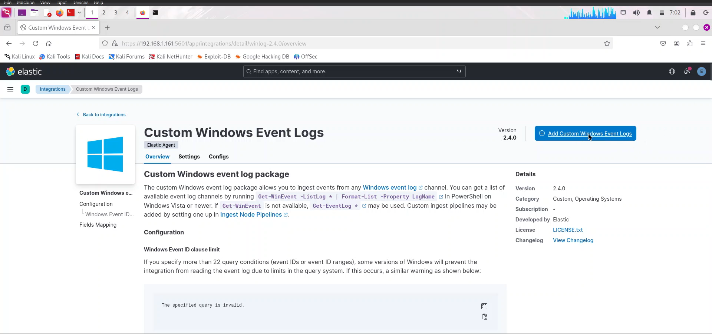

# **SIEM Log Analysis Documentation**

## **1. Project Overview**  
### **Project Name:** SIEM Log Analysis  
### **Objective:**  
The goal of this project is to analyze security logs using a Security Information and Event Management (SIEM) system, detect suspicious activities, and enhance threat intelligence. This includes collecting logs from various sources, correlating events, and responding to potential security incidents.

## **2. Tools & Technologies Used**  
- **Ubuntu:** Used as a SIEM server running Elastic Stack.  
- **Windows Server 2022:** Generates logs for security events, authentication attempts, and system behavior.  
- **Elastic Stack (ELK):** Logs collection, parsing, visualization, and correlation.  
- **Mythic C2 Server:** Simulates attacker operations and persistence mechanisms for adversarial emulation.  
- **Metasploit Framework:** Used to generate attacks and assess system vulnerabilities.  
- **Sysmon:** Provides detailed system monitoring to capture process creations, network connections, and registry changes.  

## **3. System Setup & Configuration**  
### **3.1 ELK Stack Configuration**  
1. Install **Elasticsearch**, **Logstash**, and **Kibana** on Ubuntu.  
2. Configure Logstash to ingest logs from Windows Server.  
3. Deploy **Winlogbeat** on Windows Server to ship event logs.  
4. Create SIEM dashboards in Kibana for log visualization.  

### **3.2 Windows Server 2022 Logging**  
1. Install **Sysmon** to enhance log visibility.  
2. Enable **audit policies** for login attempts, privilege escalations, and system modifications.  
3. Set up **Event Forwarding** to send logs to ELK Stack.  

### **3.3 Threat Simulation with Metasploit & Mythic C2**  
1. Set up Mythic C2 for Red Team simulations.  
2. Launch Metasploit attacks (e.g., privilege escalation, remote execution).  
3. Capture logs generated from exploits and correlate findings in SIEM.  

## **4. Log Analysis & Findings**  
### **4.1 Detecting Suspicious Events**  
- Identified **failed login attempts** and potential brute-force attacks.  
- Observed **process injections** and unexpected PowerShell executions.  
- Monitored **unusual outbound connections** originating from the compromised system.  

### **4.2 Correlation of Events**  
- Mapped attack patterns using **Kibana dashboards**.  
- Used **Logstash filters** to extract Indicators of Compromise (IoCs).  
- Analyzed timestamps to track attacker movements.  

## **5. Conclusion & Future Improvements**  
- The project demonstrated how SIEM can detect cybersecurity threats in real-time.   
- Expanding log sources to include **firewall logs and threat intelligence feeds**.

## *Walkthrough | Screenshots*

**Elastic (ELK) Stack Installation**

              

**Mythic C2 Server Installation**

         

**Sysmon Installation**

        

**Elastic Fleet and Agent Installation**

         

**Ingesting Windows Defender and Sysmon Logs to Elasticsearch**

         

**Mythic C2 Agents/C2 Profiles Installation**

          

